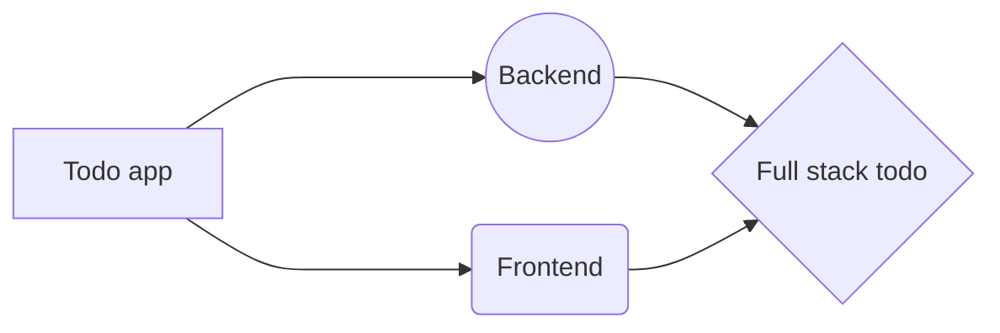

# Welcome to Todo App

Here are some steps to follow if run this locally on your machine - :)

  
## Create files and folders

Create a Todo App folder 📂  
inside it create two folders **backend & frontend** inside main folder
then follow below **steps** -  

# Steps -

 - 1st 
  Run - in a backend folder 
				   **npm init**
				  **npm install express**
				  **npm install jsonwebtoken**
				   

## Switch to another file

All your files and folders are presented as a tree in the file explorer. You can switch from one to another by clicking a file in the tree.

And this will produce a flow chart:

